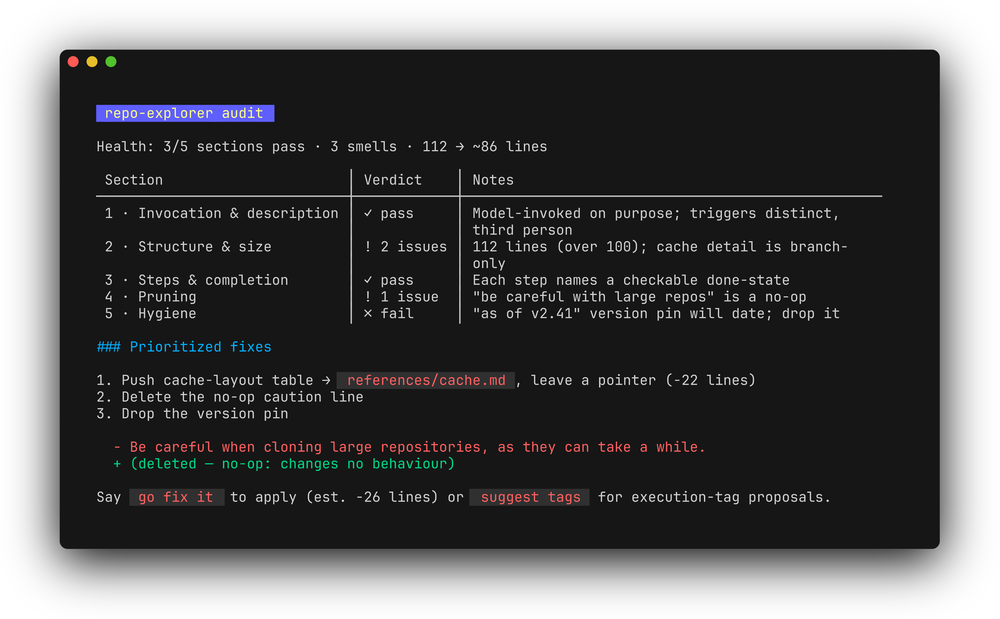
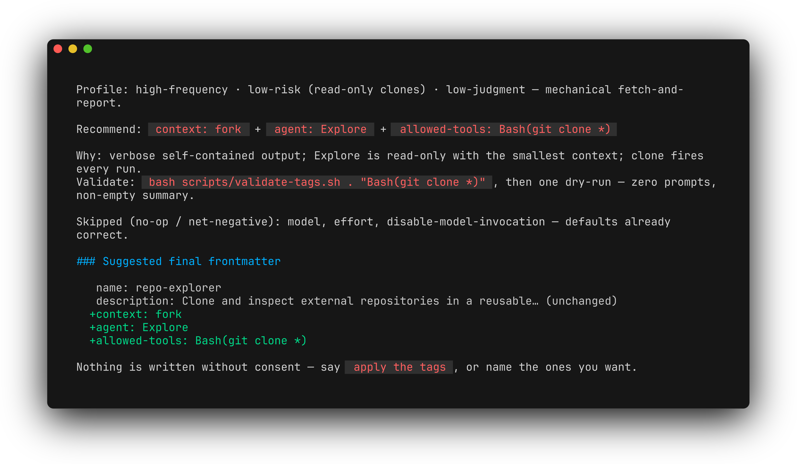

<div align="center">

# 🩺 Skill Doctor

**Five checks. One report. Tags with proof. Refactor only on consent."**

<br/>

[](https://code.claude.com/docs/en/skills)
[](https://github.com/KyTiXo/skill-doctor)

</div>

---

<table>
<tr>
<td width="50%" valign="top">

### What it does

Audits an agent skill against the [write-a-skill spec](https://github.com/mattpocock/skills) and [`writing-great-skills`](https://github.com/mattpocock/skills) checklist.

It reads the target skill, scores every row in [`references/checklist.md`](references/checklist.md), and returns a prioritized fix report. Refactors require your approval.

</td>
<td width="50%" valign="top">

### How to invoke

Invoke it against another skill:

```text
/skill-doctor audit my-skill
/skill-doctor audit my-skill with tags
/skill-doctor audit my-skill include meta-params
```

</td>
</tr>
</table>

> [!NOTE]
> Skill Doctor packages Matt Pocock's method from [*Building Great Agent Skills: The Missing Manual*](https://www.youtube.com/watch?v=UNzCG3lw6O0) (AI Engineer) — who-triggers → structure → deletion test, leading words, and the deletion test itself. The approach is his; this repo is the runnable audit skill.

---

## Example flow

```console
> /skill-doctor audit my-skill

scores checklist → prioritized content report
footer: Say suggest tags for execution-tag proposals

> Go fix it.

backs up SKILL.md → SKILL.md.bak-<date>
applies approved content fixes

> Suggest execution tags.

proposes tags + validation tests — still no writes

> Apply the tags.          # or: just fork and allowed-tools

writes approved frontmatter after tests pass
```

### What the report looks like

<!-- regen: cd docs && freeze --execute "glow -s dark -w 100 ex-report-safe.md" --config full -o report.png -->


### And the tag proposal

<!-- regen: cd docs && freeze --execute "glow -s dark -w 100 ex-tags.md" --config full -o tags.png -->


---

## What it checks

Five sections, mapped to Pocock's `write-a-skill` and `writing-great-skills`:

<table>
<tr>
<th align="left">Section</th>
<th align="left">Focus</th>
</tr>
<tr>
<td><strong>Invocation</strong></td>
<td>Trigger wording, description shape, invocation boundaries</td>
</tr>
<tr>
<td><strong>Structure</strong></td>
<td>Line count, reference splitting, co-location</td>
</tr>
<tr>
<td><strong>Steps</strong></td>
<td>Checkable, exhaustive completion criteria</td>
</tr>
<tr>
<td><strong>Pruning</strong></td>
<td>Duplicate guidance, dead instructions, vague openings</td>
</tr>
<tr>
<td><strong>Hygiene</strong></td>
<td>Time-sensitivity, terminology, examples, scripts</td>
</tr>
</table>

Full criteria: [`references/checklist.md`](references/checklist.md)

---

## Meta-params pass (opt-in)

Opt-in, default after content refactor. Say `with tags` or `include meta-params` upfront to get tag proposals in the gate-1 report instead.

Skill-doctor can suggest Claude Code execution tags per [`references/optimize-tags.md`](references/optimize-tags.md): invocation mode, `context: fork`, `model`, `effort`, and `allowed-tools` scoped to exact Bash commands.

Every tag is a **proposal with a validation test**. Consent is flexible — bulk (`apply the tags`) or cherry-pick (name the rows). Revert via `SKILL.md.bak-<date>` or drop added frontmatter. Preflight patterns with [`scripts/validate-tags.sh`](scripts/validate-tags.sh).

<table>
<tr>
<th align="left">Resource</th>
<th align="left">Purpose</th>
</tr>
<tr>
<td><a href="references/optimize-tags.md"><code>references/optimize-tags.md</code></a></td>
<td>Tag catalog, scoping rules, validation tests</td>
</tr>
<tr>
<td><a href="references/meta-params-template.md"><code>references/meta-params-template.md</code></a></td>
<td>Proposal table for gate-1 (upfront) or post-refactor passes</td>
</tr>
<tr>
<td><a href="scripts/validate-tags.sh"><code>scripts/validate-tags.sh</code></a></td>
<td>Pre-flight <code>allowed-tools</code> patterns before approving</td>
</tr>
</table>

```bash
bash scripts/validate-tags.sh .
bash scripts/validate-tags.sh . "Bash(git clone *)" "Bash(mkdir -p ~/.explore/*)"
```

Read `[GAP]` and `[CUT]` lines, tighten patterns, then dry-run the skill to confirm the tags behave as expected.

---

## Structure

```text
skill-doctor/
├── SKILL.md
├── scripts/
│   └── validate-tags.sh
├── references/
│   ├── checklist.md
│   ├── optimize-tags.md
│   ├── meta-params-template.md
│   └── report-template.md
└── README.md
```

---

## Credits

Method by **[Matt Pocock](https://mattpocock.com)** — [*Building Great Agent Skills: The Missing Manual*](https://www.youtube.com/watch?v=UNzCG3lw6O0) (AI Engineer).

## License

[MIT](./LICENSE)
